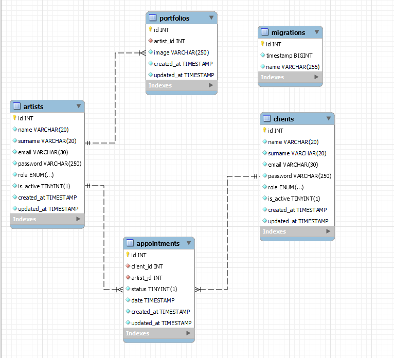

# Backend Project with TypeScript and MySQL

This project is a backend application developed using TypeScript and MySQL. It provides a simple API for managing users, allowing for the creation, updating, deletion, and retrieval of user information.

## Database diagram


## Installation

To get started with the project, follow these steps:

1. Clone the repository to your local machine.
2. Run `npm install` to install all the necessary dependencies.
3. Configure the MySQL database connection in the `config.ts` file.
4. Run the database migration scripts to set up the required tables.

## Usage

The API provides the following endpoints:

- `POST /users`: Create a new user.
- `GET /users/:id`: Retrieve a user by their ID.
- `PUT /users/:id`: Update an existing user.
- `DELETE /users/:id`: Delete a user by their ID.

Make sure to handle the error cases and validation properly.

## Technologies Used

<div align="center">
<a href="https://www.typescriptlang.org/">
    
</a>
<a href="https://nodejs.org/es/">
    
</a>
<a href="https://www.mysql.com/">
    
</a>
<a href="https://www.expressjs.com/">
    
</a>
  <a href="https://git-scm.com/">
    
</a>
</div>

## Project Structure

The project structure is organized as follows:

/src
/controllers
/models
/routes
/config
/middlewares
server.ts
/migrations
/tests
/node_modules
package.json
tsconfig.json


## Running the Application

To run the application, use the following command:

npm start

This will start the server and allow you to make requests to the provided endpoints.

## Testing (still in development)

To run the tests, execute the following command:

npm test

## Endpoints
<details>
<summary>Endpoints</summary>

### Clients
- **REGISTER**
  - `POST http://localhost:3000/client/register`
    ```json
    {
        "name": "Jose",
        "surname": "Garcia",
        "email": "JoseGarcia@gmail.com",
        "password": "1234"
    }
    ```
  Permite registrar un nuevo cliente.

- **LOGIN**
  - `POST http://localhost:3000/client/login`
    ```json
    {
        "email": "jose@gmail.com",
        "password": "1234"
    }
    ```
  Permite que un cliente inicie sesión.

- **PROFILE** (Requires Auth: user)
  - `GET http://localhost:3000/client/profile`
  Obtiene el perfil del cliente actual.

- **UPDATE** (Requires Auth: user)
  - `PUT http://localhost:3000/client/update`
    ```json
    {
        "name": "Jose",
        "surname": "Garcia",
        "email": "JoseGarcia@gmail.com",
        "password": "1234"
    }
    ```
  Permite actualizar la información del cliente.

- **GET APPOINTMENT** (Requires Auth)
  - `GET http://localhost:3000/client/appointment/:id`
  Obtiene la cita del cliente con el ID especificado.

### Artist
- **LOGIN**
  - `POST http://localhost:3000/artist/login`
    ```json
    {
        "email": "jose@gmail.com",
        "password": "1234"
    }
    ```
  Permite que un artista inicie sesión.

- **PROFILE** (Requires Auth: admin)
  - `GET http://localhost:3000/artist/profile`
  Obtiene el perfil del artista actual.

- **UPDATE** (Requires Auth: admin)
  - `PUT http://localhost:3000/artist/update`
    ```json
    {
        "name": "Jose",
        "surname": "Garcia",
        "email": "JoseGarcia@gmail.com",
        "password": "1234"
    }
    ```
  Permite actualizar la información del artista.

- **GET APPOINTMENT** (Requires Auth: admin)
  - `GET http://localhost:3000/client/appointment/:id`
  Obtiene la cita del artista con el ID especificado.

- **GET ALL ARTIST** (Requires Auth: user)
  - `GET http://localhost:3000/artist/all`
  Obtiene todos los artistas disponibles.

### Super Admin
- **REGISTER** (Requires Auth: super admin)
  - `POST http://localhost:3000/artist/register`
    ```json
    {
        "name": "Jose",
        "surname": "Garcia",
        "email": "JoseGarcia@gmail.com",
        "password": "1234"
    }
    ```
  Permite registrar un nuevo artista como un super administrador.

- **GET ALL CLIENTS** (Requires Auth: super admin)
  - `GET http://localhost:3000/artist/clients`
  Obtiene todos los clientes registrados.

- **UPDATE ROLE & ACTIVATION OF ARTIST** (Requires Auth: super admin)
  - `PUT http://localhost:3000/artist/update_admin`
    ```json
    {
        "id": 1,
        "role": "admin",
        "is_active": true
    }
    ```
  Permite actualizar el rol y la activación de un artista.

- **UPDATE ACCOUNT ACTIVATION OF CLIENT** (Requires Auth: super admin)
  - `PUT http://localhost:3000/artist/update_admin_client`
    ```json
    {
        "id": 1,
        "is_active": true
    }
    ```
  Permite actualizar la activación de la cuenta de un cliente.

### Appointment
- **CREATE** (Requires Auth: user)
  - `POST http://localhost:3000/appointments/create`
    ```json
    {
        "client_id": "1",
        "artist_id": "1",
        "date": "2023-11-28 18:00:00"
    }
    ```
  Permite crear una nueva cita.

- **UPDATE** (Requires Auth: user)
  - `PUT http://localhost:3000/appointments/update/:id`
    ```json
    {
        "artist_id": "1",
        "status": "0",
        "date": "2023-11-28 18:00:00"
    }
    ```
  Permite actualizar la información de una cita.

- **DELETE** (Requires Auth: user)
  - `DELETE http://localhost:3000/appointments/delete`
    ```json
    {
        "id": "1"
    }
    ```
  Permite eliminar una cita existente.

### Gallery
- **CREATE** (Requires Auth: admin)
  - `POST http://localhost:3000/portfolio/create`
    ```json
    {
        "artist_id": "1",
        "image": "url"
    }
    ```
  Permite crear una nueva imagen en la galería.

- **UPDATE** (Requires Auth: admin)
  - `PUT http://localhost:3000/portfolio/update/:id`
    ```json
    {
        "image": "url"
    }
    ```
  Permite actualizar la información de una imagen en la galería.

- **GET ALL IMAGES** (Requires Auth: user)
  - `GET http://localhost:3000/portfolio/all`
  Obtiene todas las imágenes disponibles en la galería.

- **DELETE** (Requires Auth: admin)
  - `DELETE http://localhost:3000/portfolio/delete`
    ```json
    {
        "id": "1"
    }
    ```
  Permite eliminar una imagen de la galería.

- **SEEDER** (Script that creates examples to fill the database, INSTALL npm install --save-dev ts-node (if not installed before))
  - `npm run seed`
</details>


## Contributing

Pull requests are welcome. For major changes, please open an issue first to discuss what you would like to change.

Please make sure to update tests as appropriate.


